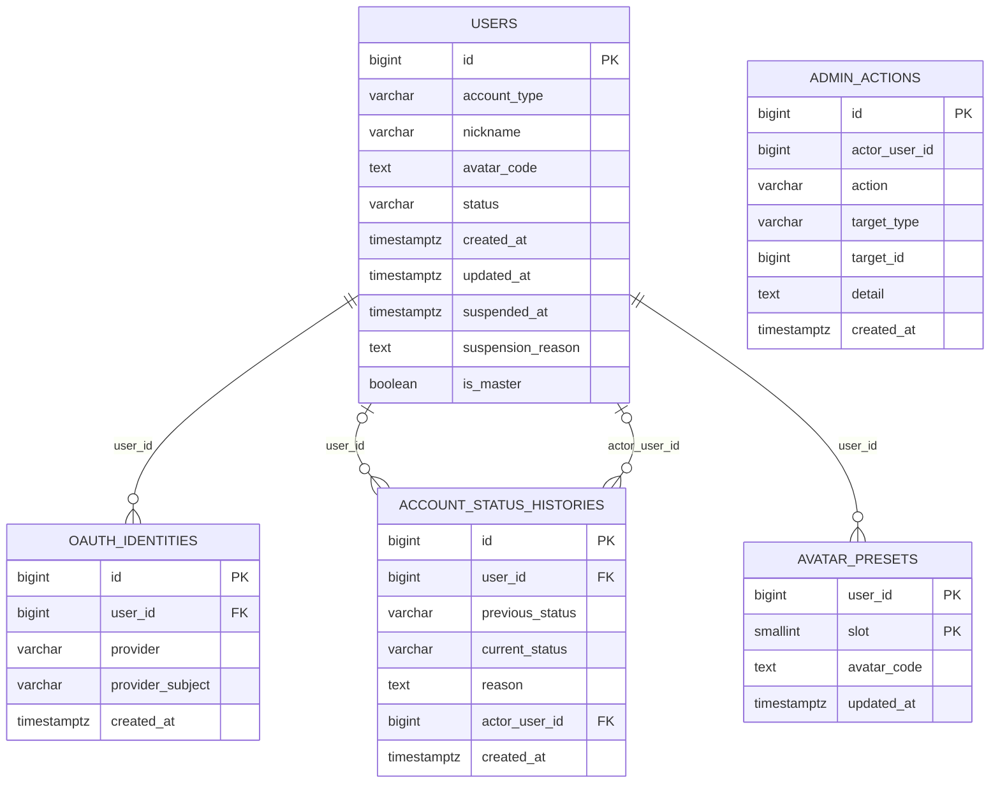
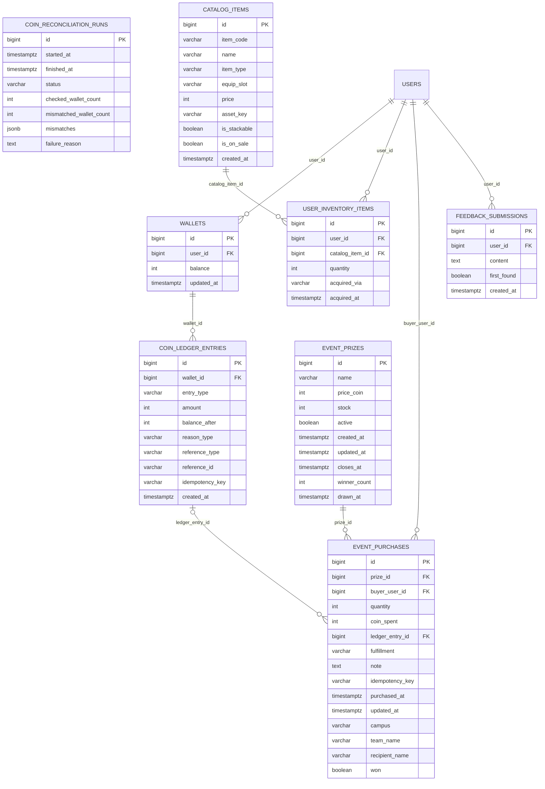
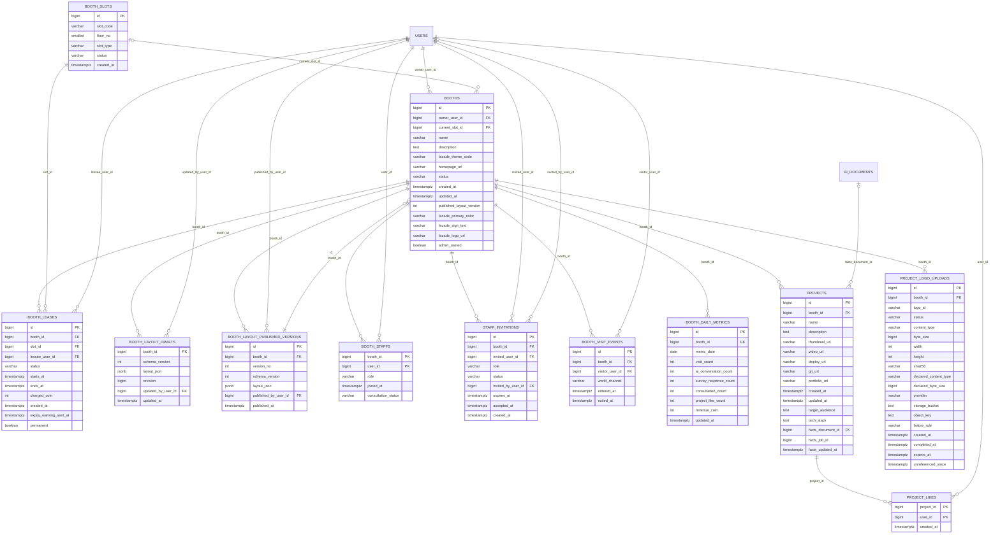
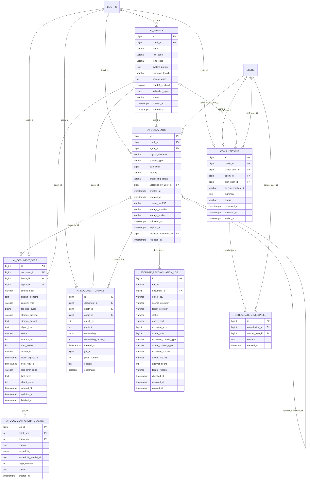
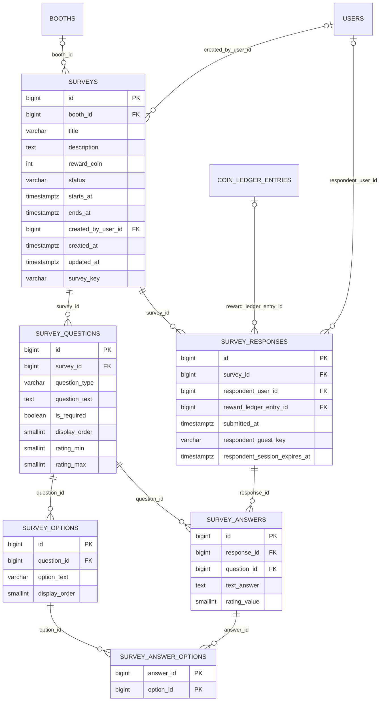
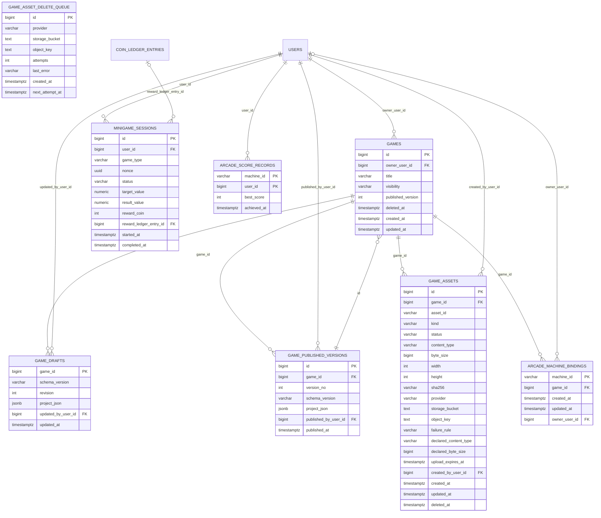

# SSAFY FESTA ERD — 현행 스키마

> **기준**: `develop` `caa1c60d` (2026-09-23) · Flyway `V1` ~ `V47` (V19 결번) · PostgreSQL 17 + pgvector
> **만든 방법**: 마이그레이션 46개를 빈 PostgreSQL 에 순서대로 적용한 뒤 `information_schema`·`pg_constraint` 에서 테이블·컬럼·외래 키·유일 인덱스를 뽑았다. 손으로 옮겨 적은 부분이 없다.
> **다른 문서와의 관계**: [09_DB_ERD_DB_설계서](./09_DB_ERD_DB_설계서.md) 는 착수 전 설계 초안(Draft)이다. 설계 원칙과 결정 배경은 그 문서가, 지금 DB 에 실제로 있는 구조는 이 문서가 기준이다.

| 항목 | 값 |
|---|---:|
| 테이블 | 47 |
| 외래 키 | 78 |
| 유일 인덱스 (PK 제외) | 42 |

Redis 에 두는 실시간 상태(Presence·채널·세션)와 Unity 게임 서버의 월드 상태는 영구 저장소가 아니라서 이 ERD 에 없다.

## 0. 영역 구성

| 영역 | 테이블 | 무엇을 저장하나 |
|---|---|---|
| 계정·권한 | users, oauth_identities, account_status_histories, admin_actions, avatar_presets | 소셜 계정 연결, 계정 정지 이력, 관리자 조치 감사, 아바타 프리셋 |
| 경제·아이템·이벤트 | wallets, coin_ledger_entries, coin_reconciliation_runs, catalog_items, user_inventory_items, event_prizes, event_purchases, feedback_submissions | 코인 잔액과 원장, 잔액 정합성 점검, 파츠 상점·보유 품목, 이벤트 경품, 피드백 |
| 부스·전시 | booth_slots, booths, booth_leases, booth_layout_drafts, booth_layout_published_versions, booth_staffs, staff_invitations, booth_visit_events, booth_daily_metrics, projects, project_likes, project_logo_uploads | 슬롯 임대, 배치 작업본·공개본, 직원, 방문 계측, 프로젝트 전시 |
| AI·상담 | ai_agents, ai_documents, ai_document_jobs, ai_document_chunks, ai_document_chunk_staging, storage_reconciliation_log, consultations, consultation_messages | AI 직원 설정, RAG 문서·청크(임베딩), 문서 처리 작업, 사람 상담 |
| 설문 | surveys, survey_questions, survey_options, survey_responses, survey_answers, survey_answer_options | 부스·이벤트 설문과 응답 |
| 게임·오락기 | games, game_drafts, game_published_versions, game_assets, game_asset_delete_queue, minigame_sessions, arcade_machine_bindings, arcade_score_records | Game Studio 게임 작업본·게시본, 미니게임 세션, 오락기 연결·점수 |

## 1. 전체 관계도

외래 키만 그린 개요다. 컬럼은 2장의 영역별 ERD에 있다. 선 이름은 외래 키 컬럼이고, `|o` 는 NULL 을 허용하는 외래 키다.

```mermaid
erDiagram
    USERS ||--o{ OAUTH_IDENTITIES : "user_id"
    USERS ||--o{ WALLETS : "user_id"
    WALLETS ||--o{ COIN_LEDGER_ENTRIES : "wallet_id"
    USERS ||--o{ BOOTHS : "owner_user_id"
    BOOTH_SLOTS |o--o{ BOOTHS : "current_slot_id"
    BOOTHS ||--o{ BOOTH_LEASES : "booth_id"
    BOOTH_SLOTS ||--o{ BOOTH_LEASES : "slot_id"
    USERS ||--o{ BOOTH_LEASES : "lessee_user_id"
    BOOTHS ||--o{ BOOTH_LAYOUT_DRAFTS : "booth_id"
    USERS ||--o{ BOOTH_LAYOUT_DRAFTS : "updated_by_user_id"
    BOOTHS ||--o{ BOOTH_LAYOUT_PUBLISHED_VERSIONS : "booth_id"
    USERS ||--o{ BOOTH_LAYOUT_PUBLISHED_VERSIONS : "published_by_user_id"
    BOOTHS ||--o{ AI_AGENTS : "booth_id"
    BOOTHS ||--o{ AI_DOCUMENTS : "booth_id"
    AI_AGENTS ||--o{ AI_DOCUMENTS : "agent_id"
    USERS ||--o{ AI_DOCUMENTS : "uploaded_by_user_id"
    BOOTHS ||--o{ AI_DOCUMENT_CHUNKS : "booth_id"
    AI_AGENTS ||--o{ AI_DOCUMENT_CHUNKS : "agent_id"
    BOOTHS ||--o{ BOOTH_STAFFS : "booth_id"
    USERS ||--o{ BOOTH_STAFFS : "user_id"
    BOOTHS ||--o{ STAFF_INVITATIONS : "booth_id"
    USERS ||--o{ STAFF_INVITATIONS : "invited_user_id"
    USERS ||--o{ STAFF_INVITATIONS : "invited_by_user_id"
    BOOTHS ||--o{ CONSULTATIONS : "booth_id"
    USERS |o--o{ CONSULTATIONS : "visitor_user_id"
    AI_AGENTS |o--o{ CONSULTATIONS : "agent_id"
    USERS |o--o{ CONSULTATIONS : "staff_user_id"
    CONSULTATIONS ||--o{ CONSULTATION_MESSAGES : "consultation_id"
    USERS ||--o{ CONSULTATION_MESSAGES : "sender_user_id"
    BOOTHS ||--o{ PROJECTS : "booth_id"
    PROJECTS ||--o{ PROJECT_LIKES : "project_id"
    USERS ||--o{ PROJECT_LIKES : "user_id"
    BOOTHS |o--o{ SURVEYS : "booth_id"
    USERS |o--o{ SURVEYS : "created_by_user_id"
    SURVEYS ||--o{ SURVEY_QUESTIONS : "survey_id"
    SURVEY_QUESTIONS ||--o{ SURVEY_OPTIONS : "question_id"
    SURVEYS ||--o{ SURVEY_RESPONSES : "survey_id"
    USERS |o--o{ SURVEY_RESPONSES : "respondent_user_id"
    COIN_LEDGER_ENTRIES |o--o{ SURVEY_RESPONSES : "reward_ledger_entry_id"
    SURVEY_RESPONSES ||--o{ SURVEY_ANSWERS : "response_id"
    SURVEY_QUESTIONS ||--o{ SURVEY_ANSWERS : "question_id"
    SURVEY_ANSWERS ||--o{ SURVEY_ANSWER_OPTIONS : "answer_id"
    SURVEY_OPTIONS ||--o{ SURVEY_ANSWER_OPTIONS : "option_id"
    USERS ||--o{ USER_INVENTORY_ITEMS : "user_id"
    CATALOG_ITEMS ||--o{ USER_INVENTORY_ITEMS : "catalog_item_id"
    USERS ||--o{ MINIGAME_SESSIONS : "user_id"
    COIN_LEDGER_ENTRIES |o--o{ MINIGAME_SESSIONS : "reward_ledger_entry_id"
    BOOTHS ||--o{ BOOTH_VISIT_EVENTS : "booth_id"
    USERS |o--o{ BOOTH_VISIT_EVENTS : "visitor_user_id"
    BOOTHS ||--o{ BOOTH_DAILY_METRICS : "booth_id"
    USERS |o--o{ ACCOUNT_STATUS_HISTORIES : "user_id"
    USERS |o--o{ ACCOUNT_STATUS_HISTORIES : "actor_user_id"
    BOOTH_LAYOUT_PUBLISHED_VERSIONS ||--o{ BOOTHS : "id"
    USERS ||--o{ GAMES : "owner_user_id"
    GAMES ||--o{ GAME_DRAFTS : "game_id"
    USERS ||--o{ GAME_DRAFTS : "updated_by_user_id"
    GAMES ||--o{ GAME_PUBLISHED_VERSIONS : "game_id"
    USERS ||--o{ GAME_PUBLISHED_VERSIONS : "published_by_user_id"
    GAME_PUBLISHED_VERSIONS ||--o{ GAMES : "id"
    GAMES ||--o{ GAME_ASSETS : "game_id"
    USERS ||--o{ GAME_ASSETS : "created_by_user_id"
    AI_DOCUMENTS ||--o{ AI_DOCUMENT_JOBS : "document_id"
    BOOTHS ||--o{ AI_DOCUMENT_JOBS : "booth_id"
    AI_AGENTS ||--o{ AI_DOCUMENT_JOBS : "agent_id"
    AI_DOCUMENTS ||--o{ AI_DOCUMENT_CHUNKS : "document_id"
    AI_DOCUMENT_JOBS ||--o{ AI_DOCUMENT_CHUNK_STAGING : "job_id"
    AI_DOCUMENTS ||--o{ STORAGE_RECONCILIATION_LOG : "document_id"
    GAMES ||--o{ ARCADE_MACHINE_BINDINGS : "game_id"
    AI_DOCUMENTS |o--o{ AI_DOCUMENTS : "replaces_document_id"
    AI_DOCUMENTS |o--o{ PROJECTS : "facts_document_id"
    EVENT_PRIZES ||--o{ EVENT_PURCHASES : "prize_id"
    USERS ||--o{ EVENT_PURCHASES : "buyer_user_id"
    COIN_LEDGER_ENTRIES |o--o{ EVENT_PURCHASES : "ledger_entry_id"
    USERS ||--o{ AVATAR_PRESETS : "user_id"
    BOOTHS ||--o{ PROJECT_LOGO_UPLOADS : "booth_id"
    USERS |o--o{ ARCADE_MACHINE_BINDINGS : "owner_user_id"
    USERS ||--o{ FEEDBACK_SUBMISSIONS : "user_id"
    USERS ||--o{ ARCADE_SCORE_RECORDS : "user_id"
```

## 2. 영역별 ERD

### 2-1. 계정·권한

`users` · `oauth_identities` · `account_status_histories` · `admin_actions` · `avatar_presets`

다른 영역 테이블은 이름만 있는 박스로 나온다.

### 2-2. 경제·아이템·이벤트

`wallets` · `coin_ledger_entries` · `coin_reconciliation_runs` · `catalog_items` · `user_inventory_items` · `event_prizes` · `event_purchases` · `feedback_submissions`

다른 영역 테이블은 이름만 있는 박스로 나온다.

### 2-3. 부스·전시

`booth_slots` · `booths` · `booth_leases` · `booth_layout_drafts` · `booth_layout_published_versions` · `booth_staffs` · `staff_invitations` · `booth_visit_events` · `booth_daily_metrics` · `projects` · `project_likes` · `project_logo_uploads`

다른 영역 테이블은 이름만 있는 박스로 나온다.

### 2-4. AI·상담

`ai_agents` · `ai_documents` · `ai_document_jobs` · `ai_document_chunks` · `ai_document_chunk_staging` · `storage_reconciliation_log` · `consultations` · `consultation_messages`

다른 영역 테이블은 이름만 있는 박스로 나온다.

### 2-5. 설문

`surveys` · `survey_questions` · `survey_options` · `survey_responses` · `survey_answers` · `survey_answer_options`

다른 영역 테이블은 이름만 있는 박스로 나온다.

### 2-6. 게임·오락기

`games` · `game_drafts` · `game_published_versions` · `game_assets` · `game_asset_delete_queue` · `minigame_sessions` · `arcade_machine_bindings` · `arcade_score_records`

다른 영역 테이블은 이름만 있는 박스로 나온다.

## 3. 유일성 제약

중복 지급·중복 임대·중복 응답을 DB 가 직접 막는 인덱스다. `WHERE` 가 붙은 것은 부분 유일 인덱스다.

| 테이블 | 인덱스 |
|---|---|
| `ai_agents` | `ux_ai_agents_booth (booth_id)` |
| `ai_document_chunks` | `ai_document_chunks_document_id_chunk_no_key (document_id, chunk_no)` |
| `ai_document_jobs` | `ix_ai_document_jobs_active_document (document_id) WHERE ((status)::text = ANY ((ARRAY['QUEUED'::character varying, 'RUNNING'::character varying, 'RETRY_WAIT'::character varying])::text[]))` |
| `ai_documents` | `ai_documents_s3_key_key (s3_key)` |
| `ai_documents` | `ux_ai_documents_agent_active_sha (agent_id, content_sha256) WHERE ((processing_status)::text = ANY ((ARRAY['QUEUED'::character varying, 'PROCESSING'::character varying, 'READY'::character varying])::text[]))` |
| `ai_documents` | `ux_ai_documents_active_replacement (replaces_document_id) WHERE ((replaces_document_id IS NOT NULL) AND ((processing_status)::text = ANY ((ARRAY['QUEUED'::character varying, 'PROCESSING'::character varying, 'READY'::character varying])::text[])))` |
| `booth_daily_metrics` | `booth_daily_metrics_booth_id_metric_date_key (booth_id, metric_date)` |
| `booth_layout_published_versions` | `booth_layout_published_versions_booth_id_version_no_key (booth_id, version_no)` |
| `booth_leases` | `ux_booth_leases_active_slot (slot_id) WHERE ((status)::text = 'ACTIVE'::text)` |
| `booth_leases` | `ux_booth_leases_active_lessee (lessee_user_id) WHERE (((status)::text = 'ACTIVE'::text) AND (NOT permanent))` |
| `booth_slots` | `booth_slots_slot_code_key (slot_code)` |
| `booths` | `booths_current_slot_id_key (current_slot_id)` |
| `booths` | `ux_booths_owner (owner_user_id) WHERE (NOT admin_owned)` |
| `catalog_items` | `catalog_items_item_code_key (item_code)` |
| `catalog_items` | `ux_catalog_items_type_asset_key (item_type, asset_key)` |
| `coin_ledger_entries` | `coin_ledger_entries_idempotency_key_key (idempotency_key)` |
| `consultations` | `ux_consultations_active_staff (staff_user_id) WHERE ((status)::text = 'ACCEPTED'::text)` |
| `consultations` | `ux_consultations_pending_visitor (booth_id, visitor_user_id) WHERE ((status)::text = 'REQUESTED'::text)` |
| `event_purchases` | `ux_event_purchases_idempotency_key (idempotency_key)` |
| `game_asset_delete_queue` | `game_asset_delete_queue_provider_storage_bucket_object_key_key (provider, storage_bucket, object_key)` |
| `game_assets` | `game_assets_game_id_asset_id_key (game_id, asset_id)` |
| `game_published_versions` | `game_published_versions_game_id_version_no_key (game_id, version_no)` |
| `minigame_sessions` | `minigame_sessions_nonce_key (nonce)` |
| `minigame_sessions` | `minigame_sessions_reward_ledger_entry_id_key (reward_ledger_entry_id)` |
| `oauth_identities` | `oauth_identities_provider_provider_subject_key (provider, provider_subject)` |
| `oauth_identities` | `oauth_identities_user_id_provider_key (user_id, provider)` |
| `project_logo_uploads` | `ux_project_logo_uploads_logo_id (logo_id)` |
| `projects` | `ux_projects_booth (booth_id)` |
| `staff_invitations` | `ux_staff_invitations_pending (booth_id, invited_user_id) WHERE ((status)::text = 'PENDING'::text)` |
| `storage_reconciliation_log` | `ux_storage_reconciliation_log_run_document (run_id, document_id)` |
| `survey_answers` | `survey_answers_response_id_question_id_key (response_id, question_id)` |
| `survey_options` | `survey_options_question_id_display_order_key (question_id, display_order)` |
| `survey_questions` | `survey_questions_survey_id_display_order_key (survey_id, display_order)` |
| `survey_responses` | `survey_responses_reward_ledger_entry_id_key (reward_ledger_entry_id)` |
| `survey_responses` | `ux_survey_responses_member (survey_id, respondent_user_id) WHERE (respondent_user_id IS NOT NULL)` |
| `survey_responses` | `ux_survey_responses_guest (survey_id, respondent_guest_key) WHERE (respondent_guest_key IS NOT NULL)` |
| `surveys` | `ux_surveys_key (survey_key) WHERE (survey_key IS NOT NULL)` |
| `surveys` | `ux_surveys_booth (booth_id)` |
| `user_inventory_items` | `user_inventory_items_user_id_catalog_item_id_key (user_id, catalog_item_id)` |
| `users` | `users_nickname_key (nickname)` |
| `users` | `ux_users_single_master (is_master) WHERE is_master` |
| `wallets` | `wallets_user_id_key (user_id)` |
