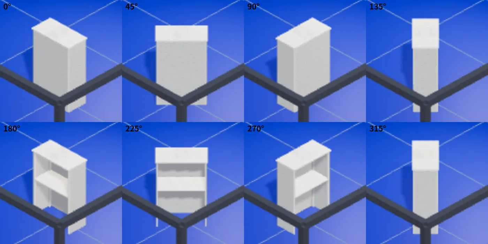
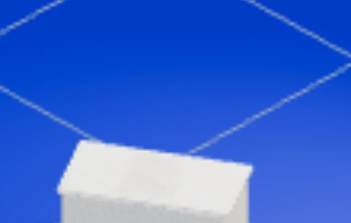
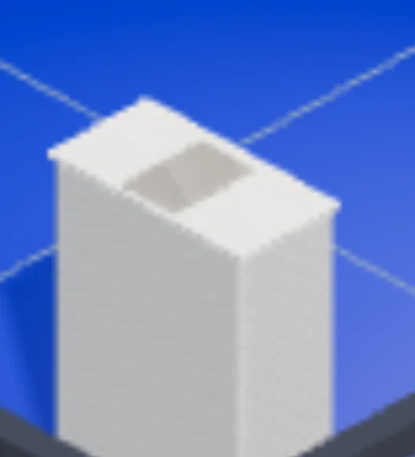
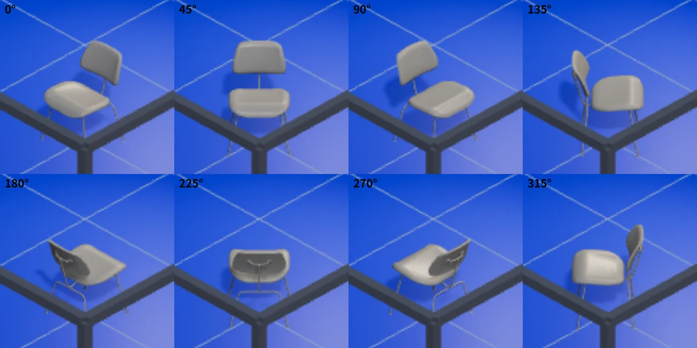
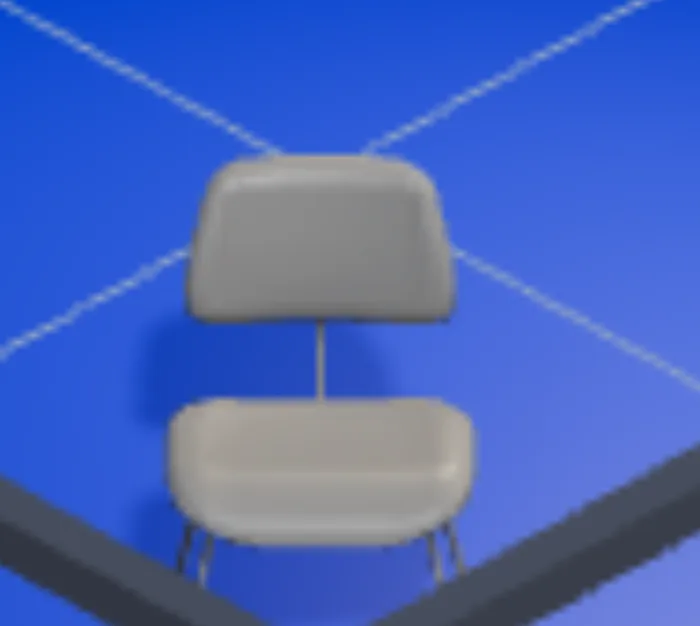

# Runtime Asset Visual Parity — 기록

> **STATUS: 8각도 시각 parity 확보 · 다중 재질 보존 확보**
>
> 갱신: 2026-09-08 · Jira `S15P21A604-480`
> 절차·서식: [`04_prototypes/booth-studio-runtime-asset-compiler.md`](../04_prototypes/booth-studio-runtime-asset-compiler.md) §9
> 수치 재현: `node festa-frontend/tools/assets/parity-report.mjs`

---

## 0. 지금 상태

Runtime Asset Compiler v1 이 대표 2종을 실제로 굽고, 그 산출물이 브라우저까지 도달한다.
**수치 대조는 끝났고 시각 대조는 절반만 됐다.**

| 항목 | 상태 |
|---|---|
| 계약 AABB 대비 축별 오차 | **확보** — `SURVEY_KIOSK` X 0.0 / Y 4.5 / Z 0.4 mm |
| Unity `.mat` ↔ 런타임 material | **확보** — 대표 2종 모두 값 일치 |
| 텍스처 채널 도달 | **확보** — GLB 내부 embed 확인 |
| 런타임 렌더 정상성 | **확보** — 대표 2종 8각도 전부 실 Chrome 에서 봤다 |
| 8각도 실루엣 | **확보** — §3·§4 의 evidence 이미지 |
| 다중 재질 보존 | **확보** — `-527` 로 키오스크 재질 3종이 살아난다(§3) |
| Source(Unity Editor) 렌더 | **`NOT_OBTAINED`** — 이 환경에 Unity Editor 가 없다 |

`NOT_OBTAINED` 는 "안 됐다" 가 아니라 **"이 환경에서 얻을 수 없다"** 다. 없는 비교를 지어 쓰지 않는다(§1 원칙).

### 이 회차에 먼저 고쳐야 했던 것

parity 를 재기 전에 결함 두 개가 앞을 막고 있었다. 둘 다 develop 에 반입됐다.

- `!424` `-476` — `.prefab` 이 CRLF 라 Unity override 가 전부 기본값으로 떨어져 **키오스크가 누워 있었다**(`0.5855 × 0.2794 × 0.9022` · 172 tri). 고친 뒤 `0.62 × 0.9255 × 0.3195` · 286 tri (LJH T-64)
- `!422` `-480` — `AssetMesh` 가 GLB 재질을 계약 색으로 덮어써 **받은 텍스처를 버리고 있었다.** 79,832 B 를 내려받고 흰 덩어리로 그렸다

즉 이전 회차의 "시각 검증 불가" 판단은 하네스 문제만이 아니었다 — **런타임 코드가 텍스처를 버리고, 파이프라인이 형상을 눕히고 있었다.**

### 캡처를 어떻게 뚫었나

두 회차 동안 8각도가 막혀 있던 이유는 **캡처 경로 하나**였다. CDP `Page.captureScreenshot` 은 크롬 창이 뒤에 있으면(`document.visibilityState: "hidden"`) 30초 timeout 이나 엉뚱한 영역을 돌려준다(LJH T-56). 창을 앞으로 꺼내 달라고 사람에게 요청할 일이 아니었다 — **그 경로를 안 쓰면 된다.**

```js
// 페이지 안에서 직접 읽는다. R3F Canvas 에 preserveDrawingBuffer: true 가 이미 있다.
const url = document.querySelector('canvas').toDataURL('image/png');
const a = document.createElement('a'); a.href = url; a.download = name; a.click();
```

같이 필요했던 것:

- `VITE_R3F_VISUAL_ACCEPTANCE=true` — `frameloop='never'` + 타이머 프레임. hidden 탭에서 `requestAnimationFrame` 이 멈춰도 상태가 화면에 반영된다
- 회전 입력은 오브젝트가 선택돼 있어야 DOM 에 있고, 선택은 **합성 PointerEvent 로는 안 되고** 실제 마우스 입력이어야 한다. 캡처 직전 빈 바닥을 눌러 선택 표시(기즈모)를 끈다
- 실 BE refresh 쿠키가 만료돼 있어 `VITE_USE_MOCK=true` 로 들어갔다. **판정 대상은 그대로다** — 런타임 GLB 는 Vite 플러그인이 `.generated/runtime` 에서 직접 내보내므로 BE 와 무관하다

---

## 1. 비교 조건

두 대상을 **같은 조건**에서 렌더한다. 조건이 다르면 비교가 아니라 인상이다.

```text
카메라        Booth Studio 고정 orthographic (편집기 실제 시점)
조명          Booth Studio 기본 조명
배경          부스 바닥·벽 (그림자 판정을 위해 유지)
후처리        없음
```

**Source 렌더는 이 조건으로 만들 수 없다.** Unity Editor 가 없어 원본을 같은 카메라에 놓을 방법이 없다. 그래서 source 열은 `NOT_OBTAINED` 로 두고, **원본 쪽 근거는 계약 AABB·`.mat` 값·원본 텍스처 파일로 대신한다**(§5).

## 2. 각도 sample

```text
0 · 45 · 90 · 135 · 180 · 225 · 270 · 315
```

Inspector 의 회전 Y 입력으로 만든다. **런타임 회전 제한이 아니다** — 실제 `rotationY` 는 `[0,360)` 자유값이고 이 8방향은 QA 표본이다.

---

## 3. 기록 — SURVEY_KIOSK_DEFAULT

```text
assetCode            SURVEY_KIOSK_DEFAULT   (objectType SURVEY_KIOSK, typeDefault)
source               _Project/Prefabs/Booth/SurveyKiosk.prefab  (Counter01 + Tablet 조립체)
source package       ExpoKit  (라이선스 REVIEW_REQUIRED → emission localSpikeOnly)
compiler             v1
```

| 항목 | intermediate | runtime | 비고 |
|---|---|---|---|
| 크기 (m) | `0.62 × 0.9255 × 0.3195` | `0.6200 × 0.9255 × 0.3196` | 계약 `0.62 × 0.93 × 0.32` |
| 계약 축별 오차 | — | **X 0.0 mm · Y 4.5 mm · Z 0.4 mm** | |
| 삼각형 | 286 | 286 | 예산 이하라 `simplify` 의도적 보류 |
| GLB | 35,792 B | **15,536 B** (43.4%) | |
| 텍스처 | 없음 | `metallicRoughness` 1장 | 원본 `Plastic_m.png` 3,386,787 B → webp |
| thumbnail | — | 4,230 B (256px) | |

**재질 대조** — `PlasticWhite.mat` 과 런타임 manifest 가 일치한다.

```text
Unity .mat   baseColor [1.000, 1.000, 1.000] · metalness 0 · roughness 0.500
manifest     baseColor [1.000, 1.000, 1.000] · metalness 0 · roughness 0.500
GLB factor   metallic 0 · roughness 0.5
```

`baseColor`·`normal` 맵이 없는 것은 **누락이 아니다** — `PlasticWhite.mat` 이 `_MetallicGlossMap` 만 참조한다. 흰 무광으로 보이는 것이 원본에 맞는 결과다.

**8각도 실루엣** — 2026-09-08, 실 Chrome, Booth Studio 편집기 카메라.



정면(0·45·90)은 천을 두른 닫힌 전면과 상판, 배면(180·225·270)은 **2단 선반**이 열려 보인다. 어느 각도에서도 눕거나 뒤집히지 않는다. 원본 계층 5개 자식이 전부 들어와 있는 것도 intermediate GLB 에서 확인했다 — `Counter01` · `Counter01Top` · `Counter01Cloth01` · `CounterShelf` · `Tablet`.

**태블릿은 있다. 다만 안 보인다.**



prefab override 가 `m_LocalPosition (0, 0.9233265, 0.02)` 이고 회전이 눕혀서, 태블릿은 상판 위에 **평평히 놓인다**(0.173 × 0.26 × 0.0043 m). 상판이 0.9255 m 이므로 계약 Y 오차 4.5 mm 와도 맞는다. 화면에서는 상판 위 옅은 사각 자국으로만 보인다.

**다중 재질은 보존된다 (`-527` 로 해소).**

처음에는 런타임 GLB 의 `materials` 가 **1개**였다. 컴파일러가 첫 재질로 몰고 나머지를 dispose 했기 때문이다. 그래서 태블릿이 검은 화면 대신 **흰 판**이 됐다(LJH T-72).

지금은 원본 셋이 그대로 구워진다.

| 런타임 재질 | 원본 | 텍스처 |
|---|---|---|
| `Tablet.mat` | 태블릿 화면 | `baseColor` **38,688 B 389×550 → 1,126 B webp** · `metallicRoughness` |
| `AluminiumBrushed.mat` | 프레임·손잡이 | `metallicRoughness` 3,391,024 → 7,218 B |
| `PlasticWhite.mat` | 카운터 본체 | `metallicRoughness` 3,386,787 → 7,392 B |

primitive → material 분포도 `{0:1, 1:1, 2:1}` 로 갈린다. 원본의 재질 슬롯 구성은 fileID 단위로 대조했다 — `SurveyKiosk` 가 `Counter01` 의 Default-Material renderer(`&23014050457739150`) 두 슬롯만 `PlasticWhite` 로 덮고, `AluminiumBrushed` renderer(`&23299921322947628`)와 `Tablet` 은 **덮지 않는다.**



상판과 구분되는 색으로 보인다. `-527` 이전에는 같은 자리가 흰 판이었다(위 `480-kiosk-tablet-top.webp`).

**대가는 바이트다** — GLB 15,536 → **27,408 B**(+76%). 텍스처가 1장에서 4장으로 늘어난 값이다. 자산 coverage 를 넓힐 때 예산을 다시 본다.

```text
source render          NOT_OBTAINED   (Unity Editor 없음)
runtime render         0·45·90·135·180·225·270·315  전부 확인

silhouette result      PASS      (8각도 모두 카운터 형상 · 배면 선반까지 원본 계층과 일치)
material result        PASS      (원본 3종이 이름·텍스처까지 런타임에 살아 있다 — -527)
thumbnail result       NOT_ASSESSED  (팔레트가 아직 thumbnail 을 소비하지 않는다)

known differences      없음
판정                   PASS_CANDIDATE
```

## 4. 기록 — FURNITURE_CHAIR02_WHITE

```text
assetCode            FURNITURE_CHAIR02_WHITE   (objectType FURNITURE, typeDefault=false)
source               ExpoKit/Models/Furniture/Chair02b.FBX  (단품)
source package       ExpoKit
compiler             v1
```

| 항목 | intermediate | runtime | 비고 |
|---|---|---|---|
| 크기 (m) | `0.5266 × 0.789 × 0.593` | `0.5266 × 0.7890 × 0.5930` | |
| 계약 축별 오차 | — | X 973.4 · Y 39.0 · Z 1127.0 mm | **정상이다** — 아래 참조 |
| 삼각형 | 1,545 | 1,545 | 예산 이하 |
| GLB | 150,116 B | **79,532 B** (53.0%) | |
| 텍스처 | 없음 | `baseColor`·`normal`·`metallicRoughness` **3장** | |
| thumbnail | — | 5,958 B (256px) | |

**계약 AABB 와 크게 다른 것이 정상이다.** `typeDefault: false` 이고, `FURNITURE` 타입 기본은 Unity 레지스트리 기준 `Furniture.prefab`(테이블 1 + 의자 3 조립체)이다. 이 자산은 **의자 단품**이라 타입 AABB 보다 작다. 계약 위반이 아니라 "타입 기본이 아닌 assetCode" 라는 뜻이다.

**텍스처 원본 → 런타임**

| 채널 | 원본 | 원본 크기 | 변환 |
|---|---|---|---|
| baseColor | `Chair02b.png` | 2,131,838 B · 2048² | 18,170 B · 512² webp |
| normal | `Chair02b_n.png` | 5,951,886 B · 2048² | 16,530 B · 512² webp |
| metallicRoughness | `Chair02b_m.png` | 2,294,330 B · 2048² | 12,904 B · 512² webp · **A(smoothness)→G(1−roughness) · R(metallic)→B 재패킹** |

**재질 대조** — `Chair02b.mat` 과 일치한다.

```text
Unity .mat   baseColor [1.000, 1.000, 1.000] · metalness 0 · roughness 0.500
manifest     baseColor [1.000, 1.000, 1.000] · metalness 0 · roughness 0.500
```

**8각도 실루엣** — 2026-09-08, 실 Chrome.



여덟 각도 모두 등판·좌석·다리가 구분되고, 배면(180·225·270)에서 등판 뒷면이 앞면보다 어둡게 나온다 — `baseColor` 가 부위별로 다르게 도달한다는 뜻이다. 다리는 좌석과 다른 황동색 와이어로 나온다.



`!422` 이전에는 이 자리가 **순백 덩어리**였다.

```text
source render          NOT_OBTAINED   (Unity Editor 없음)
runtime render         0·45·90·135·180·225·270·315  전부 확인

silhouette result      PASS      (8각도 모두 의자 형상 정상)
material result        PASS      (baseColor 가 부위별로 다르게 화면에 도달)
normal expression      NOT_ASSESSED  (0.5m 크기·120% 줌 한계로 요철을 분리할 수 없었다)
thumbnail result       NOT_ASSESSED

known differences      normal map 의 기여를 이 화면 밀도에서 분간하지 못했다
판정                   PASS_CANDIDATE
```

---

## 5. 원본 쪽 근거 — Source 렌더를 대신하는 것

Unity Editor 가 없어 source render 를 못 얻는다. 대신 **원본 파일에서 직접 읽을 수 있는 값**으로 대조한다. 이것은 실루엣 판정을 대체하지 못하고, 재질·치수 판정만 대체한다.

| 비교 항목 | 원본 근거 | 상태 |
|---|---|---|
| 비율 | 계약 `OBJECT_LOCAL_BOUNDS` 대 manifest `bounds` | **확보** |
| major shape | intermediate tri 대 runtime tri | **확보** (둘 다 무손실) |
| color · material impression | Unity `.mat` 의 `_BaseColor`·`_Metallic`·`_Smoothness` | **확보** |
| normal expression | 원본 `*_n.png` 대 runtime webp | 파일은 대조했으나 **화면 기여는 미판정** |
| silhouette | — | **대체 불가.** 8각도 렌더가 있어야 한다 |

## 6. 남은 것

1. ~~다중 재질 보존~~ — **해소됨**(`S15P21A604-527`). 키오스크 재질 3종이 살아난다(§3)
2. **normal map 기여 판정** — Booth Studio 줌 상한이 120% 라 0.5 m 오브젝트의 표면 요철을 분간할 수 없다. 더 큰 화면 또는 별도 뷰어가 필요하다
3. **thumbnail** — manifest 와 FE 타입에는 있으나 팔레트가 소비하지 않는다. asset coverage 부족 + 라이선스 게이트 때문에 **의도적으로 defer**(gate-matrix 참조)

8각도 렌더는 **해소됐다** — 막고 있던 것은 캡처 경로였고, §0 의 방법으로 사람 손 없이 뽑힌다.

## 7. 판정

```text
SURVEY_KIOSK_DEFAULT       PASS_CANDIDATE
FURNITURE_CHAIR02_WHITE    PASS_CANDIDATE
Runtime Asset Compiler v1  PASS_CANDIDATE
```

**의자는 올린다.** 8각도 실루엣이 전부 정상이고 `baseColor` 가 부위별로 화면에 도달하는 것을 눈으로 확인했다. `PASS` 가 아니라 `PASS_CANDIDATE` 인 이유는 하나 — normal map 의 화면 기여를 이 밀도에서 분리하지 못했고, 그것을 `known differences` 에 적어 두었기 때문이다.

**키오스크도 올린다.** 형상은 8각도 전부 원본 계층과 맞고, 마지막까지 남았던 재질 축약이 `-527` 로 해소돼 원본 3종이 살아난다.

**Compiler v1 도 `PASS_CANDIDATE` 로 올린다.** `PASS` 가 아닌 이유는 두 자산 공통으로 하나 — normal map 의 화면 기여를 이 밀도에서 분리하지 못했다(§6-2). 그것 말고 `known differences` 는 비어 있다.
