# SSAFY FESTA 시연 시나리오

> **기준**: demo 서버 `https://demo.ssafesta.world` (Front `a16e29eb`, 2026-09-23). 스크린샷은 모두 이날 demo 화면에서 새로 찍었고, 다른 사용자 닉네임은 흐리게 처리했다.
> **준비물**: 크롬 데스크톱 1대(회원 계정 A), 가능하면 1대 더(회원 계정 B, 방문자 역할). 두 창 모두 **보이는 탭**으로 둔다 — 숨은 탭은 Unity 가 멈춰 월드 연결이 끊긴다.
> **조작**: `WASD` 이동 · `F` 상호작용 · `Enter` 채팅 · `Esc` 메뉴. 텍스트 입력 화면(채팅·설문·AI 대화·관리 화면)은 모두 React 오버레이다.

## 흐름

| # | 단계 | 역할 | 화면 |
|---:|---|---|---|
| 1 | 로그인 | A | 로그인 페이지 |
| 2 | 아바타 | A | 캐릭터 꾸미기 |
| 3 | 월드 입장 | A | 11층 축제장 |
| 4 | 부스 임대 | A | Esc 메뉴 → 부스 관리 → 부스 선택 |
| 5 | 부스 관리 | A | 내 부스 관리 |
| 6 | 프로젝트 등록·운영 설정 | A | 프로젝트 / 설문 / AI 직원 / 상담 운영 |
| 7 | 부스 방문·전시 확인 | B | 월드 부스 내부 |
| 8 | AI 직원 대화 | B | AI 대화 오버레이 |
| 9 | 상담 | B → A | 상담 요청 → 상담 운영 |
| 10 | 설문 | B | 설문 오버레이 |
| 11 | 코인 지급·변화 | A, B | 일일 미션, 메뉴의 코인 |
| 12 | 오락기 | B | 광장 오락기·미니게임 |

---

## 1. 로그인

| 항목 | 내용 |
|---|---|
| 목적 | 소셜 계정으로 회원 세션을 만든다 |
| 사전조건 | 계정 A 가 SSAFY·Google·Kakao 중 하나에 로그인 가능 |
| 진입 위치 | `https://demo.ssafesta.world` → "화면을 클릭해 시작하기" → 로그인 화면 |
| 클릭·입력 | **SSAFY 로그인** (또는 Google·Kakao) → 제공자 로그인 → 처음이면 닉네임 입력 |
| 기대 결과 | 캐릭터 꾸미기 화면으로 넘어간다 |
| 확인 포인트 | 주소가 `/app/world` 로 바뀐다. 자체 회원가입 버튼은 없다 |
| 실패 시 | 제공자 로그인이 막히면 다른 제공자로 로그인한다. **게스트로 둘러보기**는 월드 관람만 되고 임대·설문 보상·미션은 안 된다 |

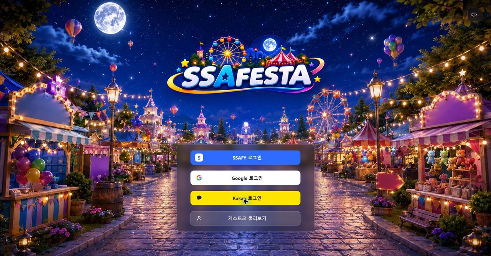

## 2. 아바타

| 항목 | 내용 |
|---|---|
| 목적 | 월드에서 쓸 외형을 고른다 |
| 사전조건 | 회원 로그인 (게스트는 이 화면을 건너뛴다) |
| 진입 위치 | 로그인 직후, 또는 Esc 메뉴 → **아바타 변경** |
| 클릭·입력 | 왼쪽 **의상 선택**(상의·하의·한벌옷·신발), 오른쪽 **나만의 캐릭터**(얼굴·헤어·모자·액세서리)와 색상 → 필요하면 **저장**으로 프리셋 슬롯 1~3 에 보관 → **월드 입장** |
| 기대 결과 | 고른 외형이 가운데 캐릭터에 바로 반영된다 |
| 확인 포인트 | 재로그인해도 외형이 유지된다 (서버 저장). 상점에서 사지 않은 파츠는 착용할 수 없다 |
| 실패 시 | 외형 저장이 실패해도 월드 입장은 된다. **초기화**로 기본 외형으로 들어간다 |

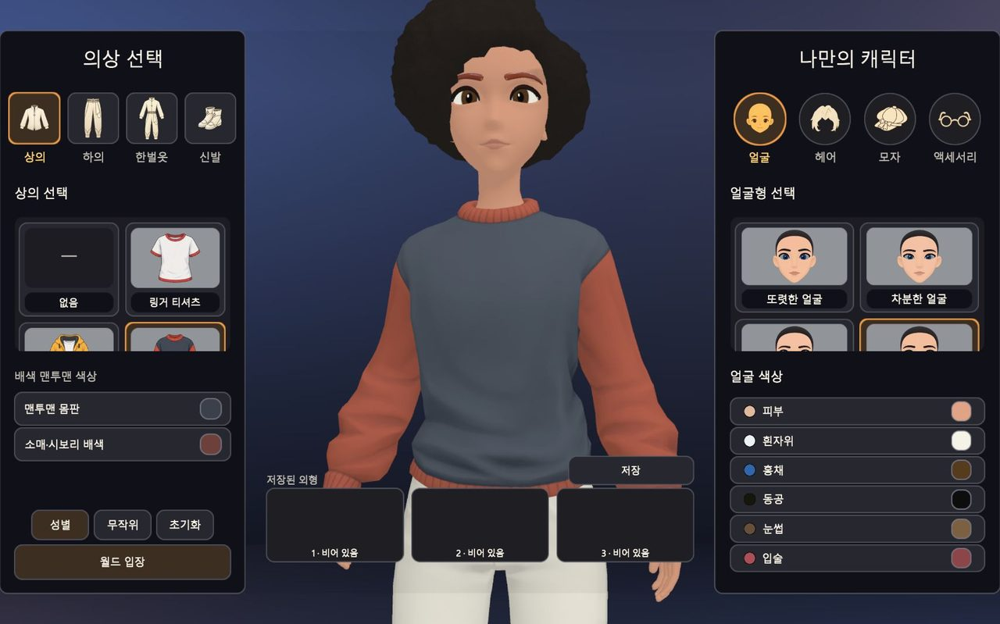

## 3. 월드 입장

| 항목 | 내용 |
|---|---|
| 목적 | 11층 축제장에 접속해 다른 사용자와 같은 공간에 선다 |
| 사전조건 | 2단계 완료 |
| 진입 위치 | **월드 입장** → 엘리베이터 연출 → "축제장을 불러오고 있어요" |
| 클릭·입력 | 환영 안내가 뜨면 **축제 둘러보기** |
| 기대 결과 | 로비에 스폰되고 이름표가 보인다. 다른 접속자도 이름표와 함께 보인다 |
| 확인 포인트 | 상단 HUD: 일일 미션, 상담, 채팅, 전체화면. 다른 창(B)에서 A 의 이동이 보인다 |
| 실패 시 | "월드를 준비하고 있습니다"에서 멈추면 탭이 앞에 있는지 확인하고 화면을 한 번 클릭한다. 그래도 안 되면 새로고침한다 (자동 재접속) |

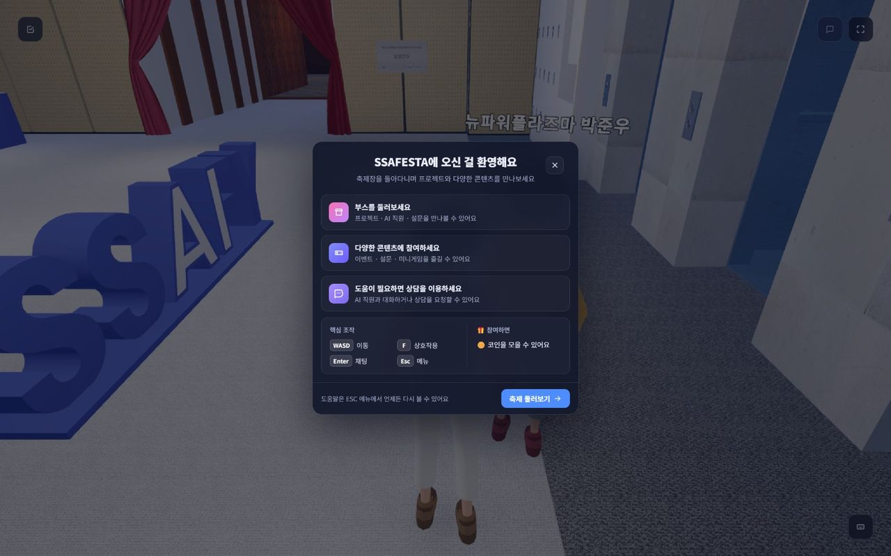
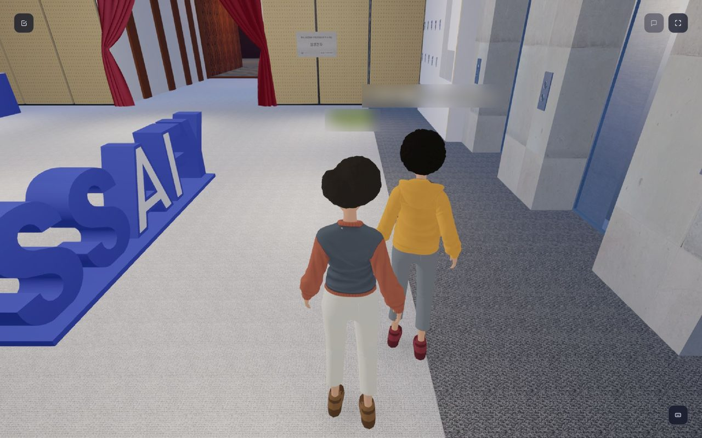

## 4. 부스 임대

| 항목 | 내용 |
|---|---|
| 목적 | 코인으로 전시 자리를 24시간 빌린다 |
| 사전조건 | 회원, 보유 코인 50 이상, 운영 중인 부스가 없음 (1인 1부스) |
| 진입 위치 | `Esc` → **부스 관리** → "아직 운영 중인 부스가 없습니다" → **부스 임대하기** |
| 클릭·입력 | 부스 선택 맵에서 "임대 가능" 자리(예: F11-R12) 선택 → 오른쪽 **임대** → 확인 창 **50코인 차감하고 임대** |
| 기대 결과 | 내 부스 관리 화면이 열리고 "운영 중", 남은 임대 시간(24시간)이 보인다 |
| 확인 포인트 | 보유 코인이 50 줄어든다. "사용 중"·"운영 부스" 자리는 선택할 수 없다 |
| 실패 시 | 다른 사람이 먼저 잡은 자리면 "이미 임대 중"으로 거절되고 맵이 갱신된다 — 다른 자리를 고른다 |

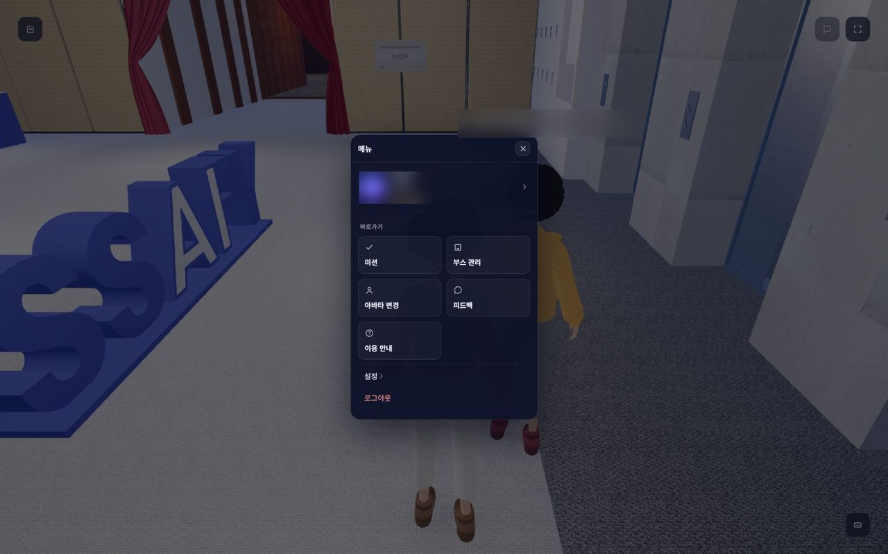
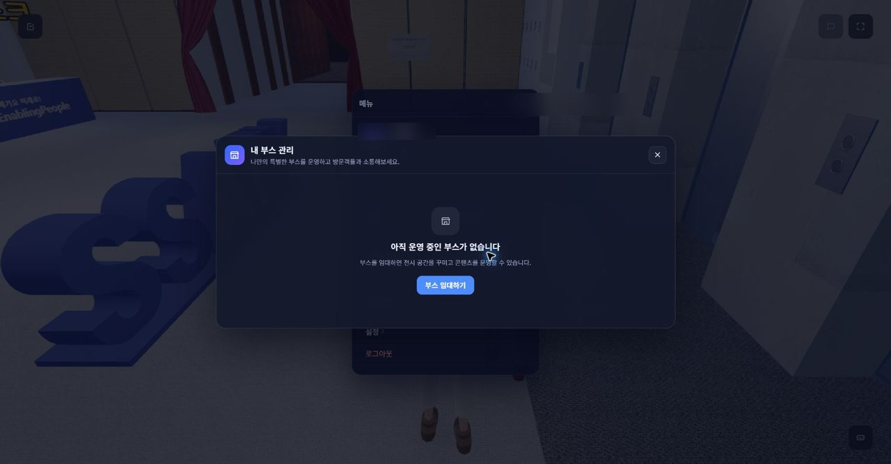
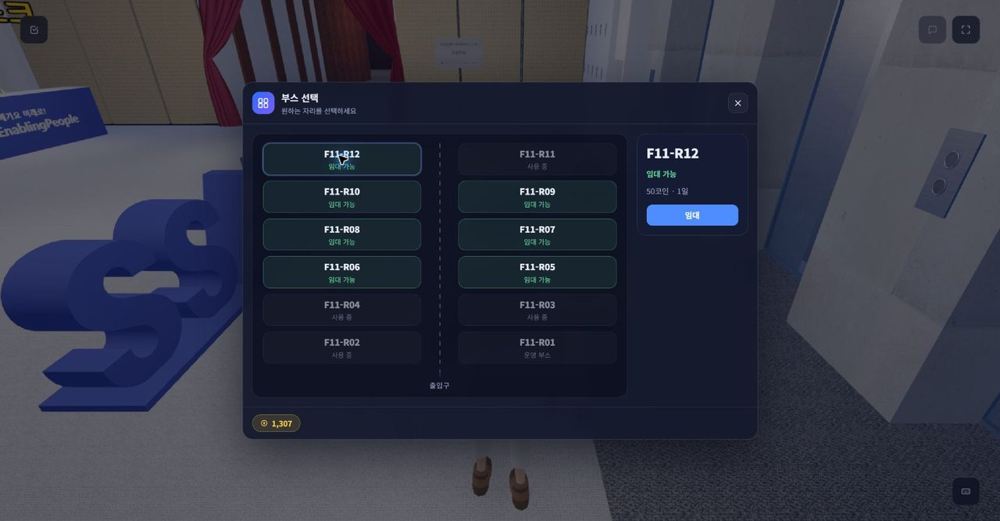
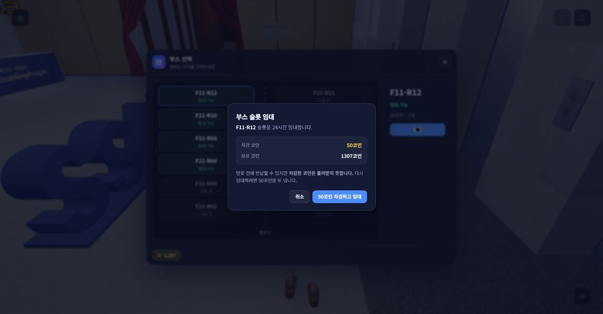

## 5. 부스 관리

| 항목 | 내용 |
|---|---|
| 목적 | 빌린 부스의 상태와 운영 기능을 한 화면에서 본다 |
| 사전조건 | 4단계 완료 |
| 진입 위치 | `Esc` → **부스 관리** |
| 클릭·입력 | **부스 이름** 입력 후 저장 → 부스 미리보기 확인 |
| 기대 결과 | 왼쪽에 방문자가 보는 부스 미리보기, 오른쪽에 부스 번호·남은 시간·운영 관리 4개(프로젝트·설문·상담·AI 직원) |
| 확인 포인트 | 부스는 기본 구성으로 제공되는 고정 부스다 (배치 편집 없음). "AI 전시 에셋 관리"는 추후 제공 표시 |
| 실패 시 | 임대가 끝났으면 "운영 중인 부스가 없습니다"로 돌아간다 — 4단계를 다시 한다 |

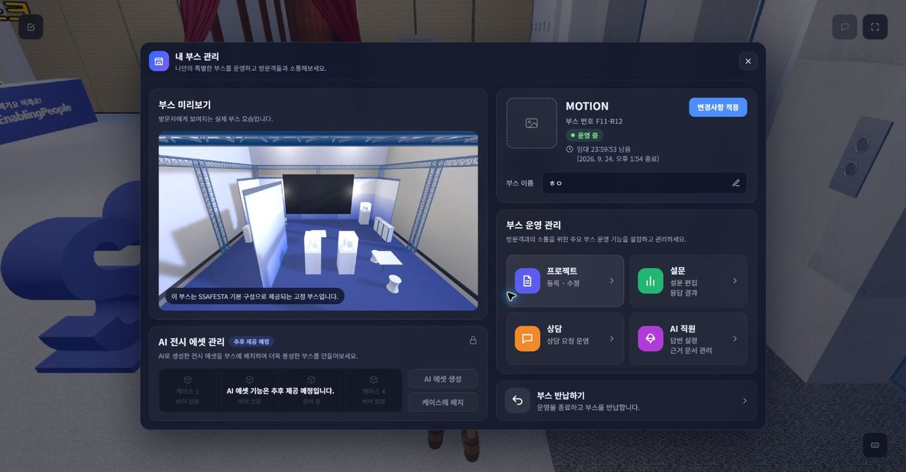

## 6. 프로젝트 등록·운영 설정

| 항목 | 내용 |
|---|---|
| 목적 | 방문자에게 보일 전시 내용과 운영 기능을 채운다 |
| 사전조건 | 5단계 |
| 진입 위치 | 내 부스 관리 → 부스 운영 관리의 각 카드 |
| 클릭·입력 | **프로젝트**: 대표 이미지(PNG·JPG·GIF·WebP, 5MB 이하), 이름, 소개, 소개 영상 주소, 서비스·저장소·포트폴리오 주소 → **변경 저장** **설문**: 설문 제목, 응답 보상 코인 → **+ 문항 추가** → **설문 저장** **AI 직원**: 이름·역할·말투·답변 길이·시스템 프롬프트·금지 주제, "사람 상담으로 연결 허용" → **설정 저장** → **문서 업로드**(PDF·Markdown·텍스트, 20MB 이하, 최대 10개) **상담**: 상담 운영 화면을 열어 둔다 |
| 기대 결과 | 저장한 내용이 부스 미리보기와 월드 부스에 반영된다. AI 문서는 처리 완료 후 답변 근거가 된다 |
| 확인 포인트 | 설문은 저장하면 바로 공개된다. 문서는 "처리 중" → "완료" 로 바뀐 뒤에만 쓰인다 |
| 실패 시 | 이미지 규격 위반은 저장 전에 안내된다. 문서 처리가 실패하면 목록에 실패로 표시되니 다시 올린다 |

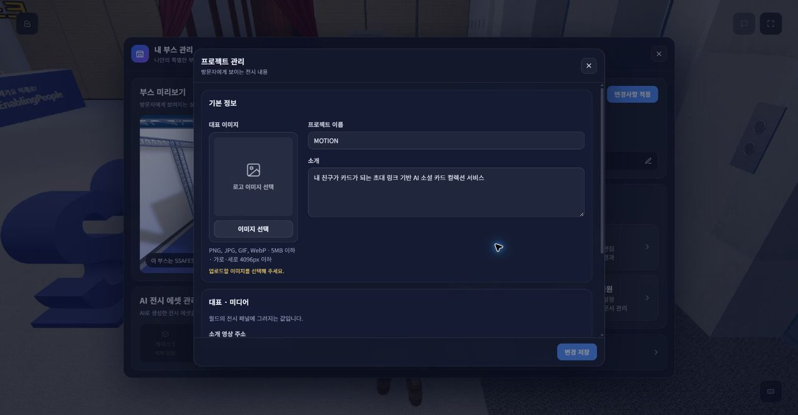
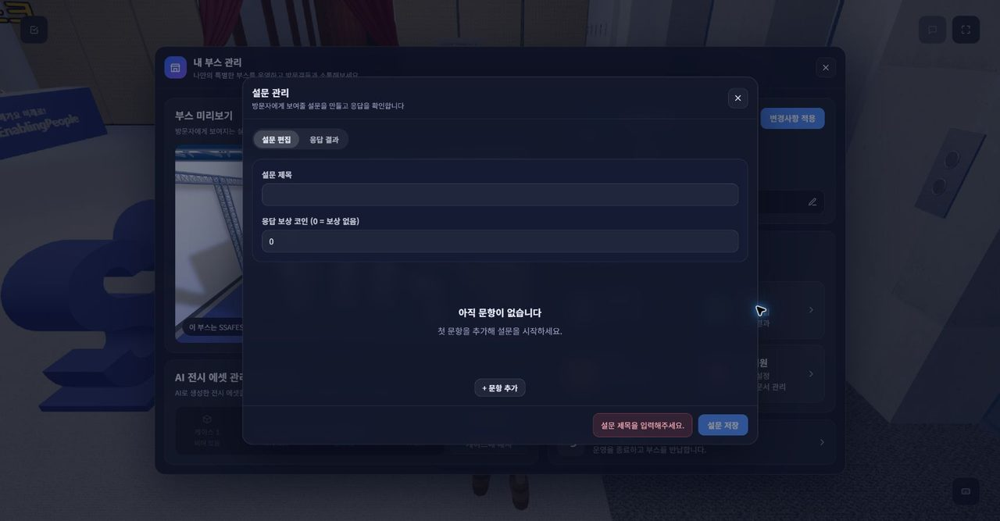
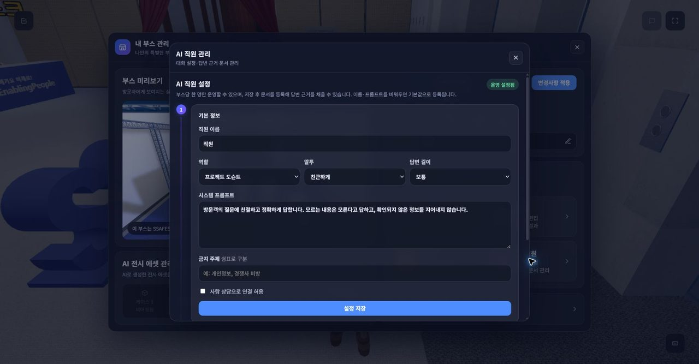
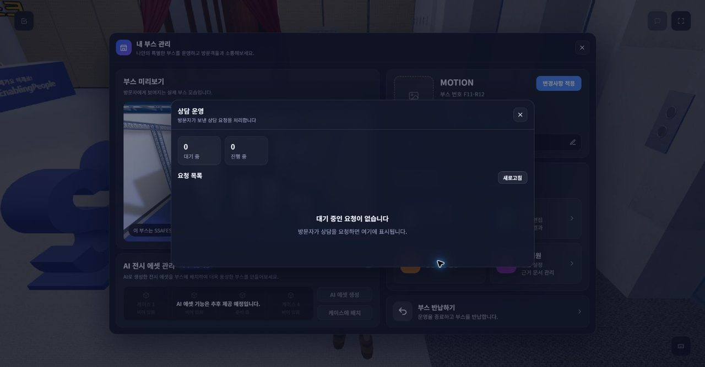

## 7. 부스 방문·전시 확인

| 항목 | 내용 |
|---|---|
| 목적 | 방문자 입장에서 게시된 부스를 체험한다 |
| 사전조건 | 계정 B 로 1~3단계 완료, A 의 부스에 6단계 내용이 있음 |
| 진입 위치 | 로비에서 부스 복도(커튼 입구)로 걸어 들어가 A 의 부스(F11-R12) 앞 |
| 클릭·입력 | 부스 간판 확인 → 전시 패널 앞에서 `F` (프로젝트 상세) → 노트북 앞에서 `F` (서비스 홈페이지) |
| 기대 결과 | 프로젝트 이름·소개·영상·링크가 오버레이로 열린다. 홈페이지는 창 안에서 열리고, 사이트가 막으면 새 탭으로 연다 |
| 확인 포인트 | 부스 간판·화면에 6단계에서 저장한 값이 나온다. 부스에 들어가면 일일 미션 "부스 둘러보기"가 올라간다 |
| 실패 시 | 간판이 비어 있으면 A 가 프로젝트를 저장했는지 확인한다. 홈페이지가 창 안에서 막히면 새 탭 열기 버튼을 쓴다 |

캡처 없음 — 월드 안을 걸어서 이동하는 단계라 시연 리허설 때 추가한다.

## 8. AI 직원 대화

| 항목 | 내용 |
|---|---|
| 목적 | 부스 문서를 근거로 답하는 AI 직원과 대화한다 |
| 사전조건 | 7단계, A 가 AI 직원을 설정하고 문서 처리가 완료됨 |
| 진입 위치 | 부스 안 AI 직원 NPC 앞에서 `F` |
| 클릭·입력 | 질문 입력(예: "이 프로젝트는 어떤 서비스야?") → 전송 |
| 기대 결과 | 답변이 글자 단위로 흘러나온다 (스트리밍) |
| 확인 포인트 | 답변이 이 부스 문서 내용에 근거한다 (다른 부스 문서는 쓰지 않는다). 일일 미션 "AI 직원과 이야기 나누기" 달성 |
| 실패 시 | 답변이 늦거나 실패하면 다시 질문한다. AI 장애가 있어도 월드 이동·다른 기능은 그대로 된다 |

캡처 없음 — 7단계와 같은 이유.

## 9. 상담

| 항목 | 내용 |
|---|---|
| 목적 | 방문자가 부스 운영자와 실시간 상담한다 |
| 사전조건 | A 가 상담 운영 화면(6단계)을 열어 둠, B 는 A 의 부스 안 |
| 진입 위치 | B: 상단 HUD **상담** (부스 안에 있을 때 활성화된다) 또는 AI 대화에서 사람 상담 연결 (A 가 연결을 허용한 경우) |
| 클릭·입력 | B: 상담 요청 → A: 상담 운영의 요청 목록에서 수락 → 양쪽 메시지 입력 |
| 기대 결과 | A 의 "대기 중"이 1 늘고, 수락하면 "진행 중"으로 옮겨 대화가 오간다 |
| 확인 포인트 | 요청은 10분이 지나면 만료된다. 회원 전용 기능이다 |
| 실패 시 | A 쪽 목록에 안 보이면 **새로고침**을 누른다 |

캡처: 운영자 쪽 화면은 6단계 "상담 운영" 스크린샷. 방문자 쪽은 리허설 때 추가한다.

## 10. 설문

| 항목 | 내용 |
|---|---|
| 목적 | 부스 설문에 응답하고 보상을 받는다 |
| 사전조건 | A 가 설문을 저장함(보상 코인 1 이상이면 보상 확인 가능) |
| 진입 위치 | 부스 안 설문 키오스크 앞에서 `F` |
| 클릭·입력 | 문항 응답 → 제출 |
| 기대 결과 | 제출 완료 안내, 보상 코인 지급 |
| 확인 포인트 | 한 사람은 한 번만 응답한다. A 의 설문 관리 → **응답 결과** 탭에 집계가 올라간다. 일일 미션 "설문 참여하기" 달성 |
| 실패 시 | 제출이 거절되면 안내 문구에 따라 빠진 응답을 채우고 다시 제출한다 |

캡처 없음 — 7단계와 같은 이유.

## 11. 코인 지급·변화

| 항목 | 내용 |
|---|---|
| 목적 | 활동에 따라 코인이 쌓이고 쓰이는 것을 보여준다 |
| 사전조건 | 회원 |
| 진입 위치 | 좌측 상단 **일일 미션**, `Esc` 메뉴의 내 정보(보유 코인) |
| 클릭·입력 | 달성한 미션의 **받기** |
| 기대 결과 | "일일 미션 보상으로 15 코인을 받았습니다" 알림, 오늘 합계가 올라간다 |
| 확인 포인트 | 부스 임대 −50, 미션 +15, 설문 보상 +N 이 메뉴의 보유 코인에 반영된다. 하루 기준은 한국 시간이다 |
| 실패 시 | 이미 받은 미션은 "완료됨"으로 바뀌어 다시 받을 수 없다 |

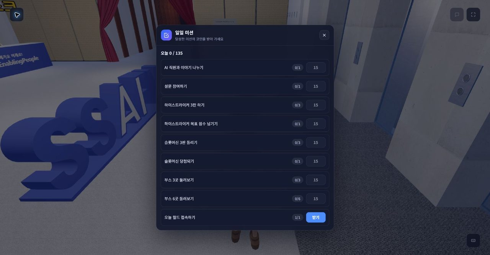
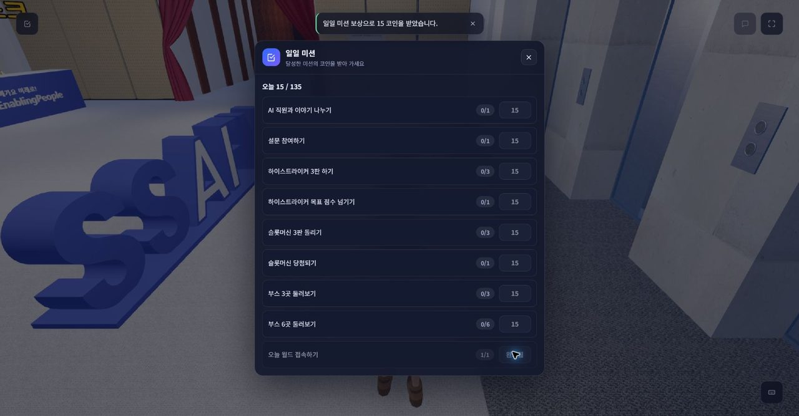

## 12. 오락기

| 항목 | 내용 |
|---|---|
| 목적 | 광장 오락기와 미니게임으로 월드 체류를 이어간다 |
| 사전조건 | 월드 입장 |
| 진입 위치 | 오락실의 오락기 앞, 하이스트라이커·슬롯머신 앞에서 `F` |
| 클릭·입력 | 오락기: 게임 시작 → 플레이 → 종료. 하이스트라이커: 타이밍에 맞춰 입력. 슬롯머신: 돌리기 |
| 기대 결과 | 게임이 오버레이로 열리고, 오락기별 상위 5명 랭킹이 보인다 |
| 확인 포인트 | 하이스트라이커 3판·목표 점수, 슬롯머신 3판·당첨 미션이 올라간다. 미니게임 보상은 하루 한도가 있다 |
| 실패 시 | 게임 창을 닫으면 월드로 돌아온다. 다른 사람이 쓰는 기계는 비었을 때 다시 시도한다 |

캡처 없음 — 7단계와 같은 이유.

